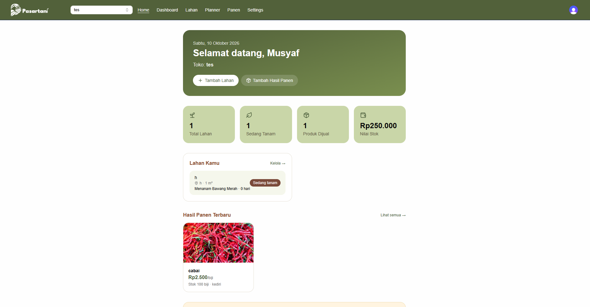
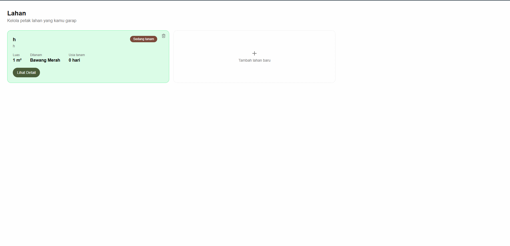
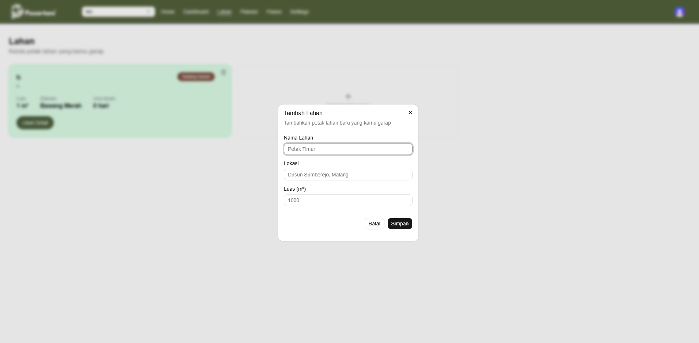
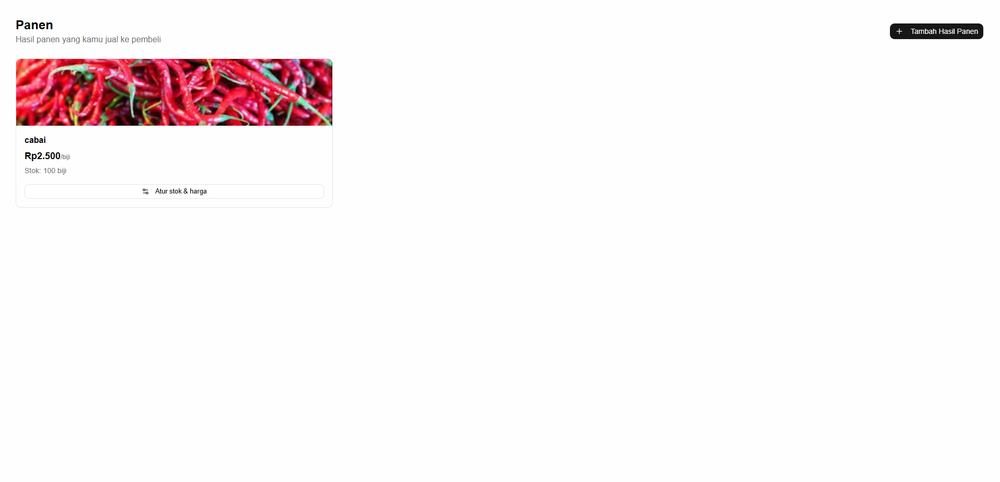
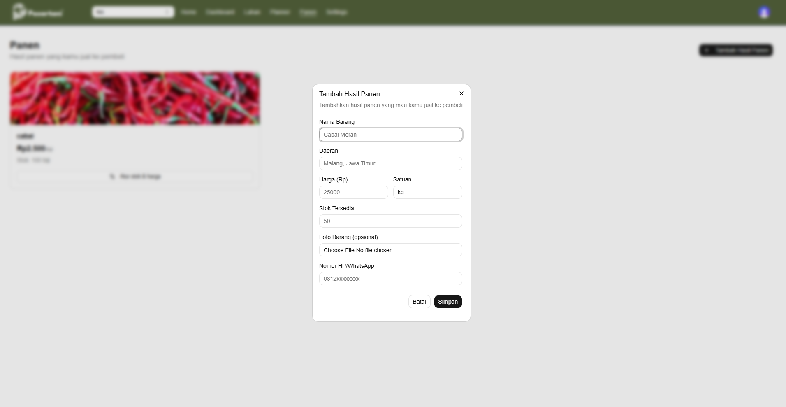
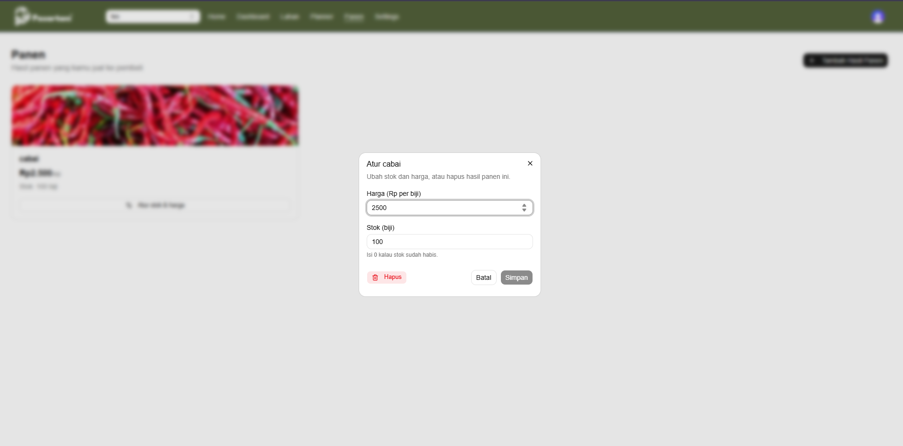
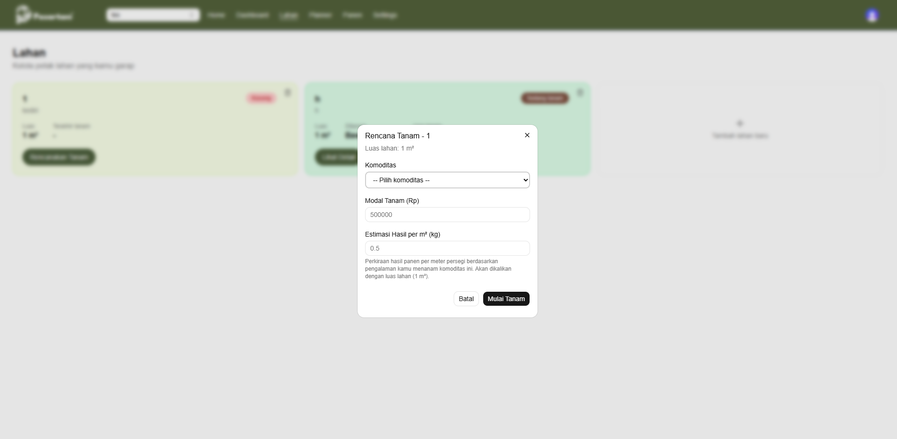
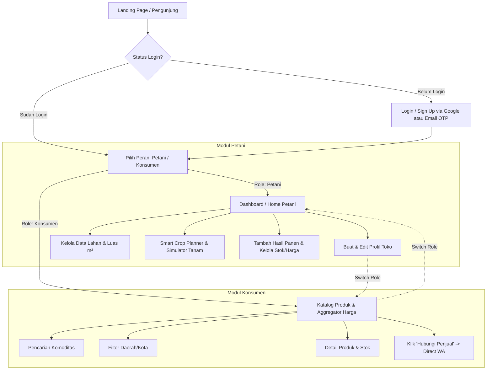

# PasarTani

> **PasarTani** adalah platform *agritech* berbasis web yang memotong rantai distribusi pertanian dengan menghubungkan petani secara langsung ke konsumen (*Direct-to-Consumer*). Dilengkapi dengan *Smart Crop Planner* untuk estimasi panen, pembaruan harga real-time, serta edukasi agroteknologi guna mengatasi asimetri harga dan meningkatkan kesejahteraan petani.

---

## Lencana (Badges)

[](https://nextjs.org)
[](https://react.dev)
[](https://www.typescriptlang.org)
[](https://tailwindcss.com)
[](https://www.prisma.io)
[](https://clerk.com)
[](https://prisma-fest-tierison.vercel.app/)

---

## Daftar Isi (Table of Contents)

- [Lencana (Badges)](#lencana-badges)
- [Deskripsi Proyek](#deskripsi-proyek)
- [Tangkapan Layar / Demo (Screenshots)](#tangkapan-layar--demo-screenshots)
- [Fitur Utama](#fitur-utama)
- [Alur Kerja Aplikasi (Web Flow)](#alur-kerja-aplikasi-web-flow)
- [Prasyarat / Kebutuhan Sistem (Requirements)](#prasyarat--kebutuhan-sistem-requirements)
- [Cara Instalasi (Installation)](#cara-instalasi-installation)
- [Cara Penggunaan (Usage)](#cara-penggunaan-usage)
- [Kontribusi (Contributing)](#kontribusi-contributing)

---

## Deskripsi Proyek

PasarTani hadir untuk mengatasi tantangan mendasar dalam rantai pasok pertanian dan literasi agroteknologi di Indonesia. Saat ini, rantai distribusi komoditas pangan dari petani hingga ke konsumen sangat panjang (melewati 5–6 titik perantara seperti tengkulak, pengepul, pasar induk, dan pedagang eceran). Kondisi ini menyebabkan harga jual di tingkat petani sangat rendah, sementara harga beli di tingkat konsumen menjadi sangat mahal.

Selain itu, petani sering mengalami risiko *over-supply* dan fluktuasi harga akibat asimetri informasi serta kurangnya perencanaan masa tanam yang tersinkronisasi dengan kebutuhan pasar.

### Solusi yang Ditawarkan

- **Direct-to-Consumer (Direct-to-Buyer):** Memotong rantai distribusi menjadi hanya 2–3 titik dengan menghubungkan kelompok tani langsung ke pembeli (masyarakat urban, UMKM, restoran, katering) melalui integrasi transaksi WhatsApp.
- **Smart Crop Planner & Simulasi Planner:** Membantu petani memprediksi harga panen berdasarkan tren dan mengatur jadwal tanam agar waktu panen bertepatan dengan momen harga komoditas sedang tinggi.
- **Aggregator Harga & Katalog Transparan:** Menyajikan pembaruan harga harian secara real-time dari pasar lokal untuk meningkatkan posisi tawar (*bargaining power*) petani.
- **Edukasi & Literasi Agroteknologi:** Memberikan wawasan tata cara teknik tanam modern dan pengelolaan pascapanen.

---

## Tangkapan Layar / Demo (Screenshots)

> **Demo Live Aplikasi:** [https://prisma-fest-tierison.vercel.app/](https://prisma-fest-tierison.vercel.app/)

<table>
  <tr>
    <th>Landing Page &amp; Deskripsi Solusi</th>
  </tr>
  <tr>
    <td align="center">
      
      <br />
      <sub>(Tampilan Halaman Utama &amp; Login)</sub>
    </td>
  </tr>
</table>

<table>
  <tr>
    <th colspan="2">Dashboard &amp; Manajemen Lahan Petani</th>
  </tr>
  <tr>
    <td width="50%" align="center"></td>
    <td width="50%" align="center"></td>
  </tr>
  <tr>
    <td width="50%" align="center"></td>
    <td width="50%" align="center"></td>
  </tr>
  <tr>
    <td width="50%" align="center"></td>
    <td width="50%" align="center"></td>
  </tr>
  <tr>
    <td colspan="2" align="center"><sub>(Tampilan Manajemen Toko, Lahan &amp; Hasil Panen)</sub></td>
  </tr>
</table>

<table>
  <tr>
    <th width="50%">Smart Crop Planner &amp; Simulasi</th>
    <th width="50%">Katalog Produk &amp; Direct-to-Buyer Konsumen</th>
  </tr>
  <tr>
    <td align="center">
      
      <br />
      <sub>(Perencana Tanam &amp; Proyeksi Panen)</sub>
    </td>
    <td align="center">
      
      <br />
      <sub>(Pencarian Komoditas &amp; Kontak WA Penjual)</sub>
    </td>
  </tr>
</table>

---

## Fitur Utama

- **Authentication & Otentikasi Mudah:** Dukungan login cepat menggunakan Akun Google (Google Auth) atau pendaftaran manual email/username dengan verifikasi kode OTP ke Gmail.
- **Sistem Multi-Peran (Multi-Role System):** Pengguna dapat memilih peran sebagai Petani atau Konsumen dan dapat melakukan *Switch Role* kapan saja.
- **Manajemen Toko & Lahan (Modul Petani):**
  - Pembuatan nama toko dan penyapaan terpersonalisasi.
  - Pendataan lahan pertanian (Nama Lahan, Lokasi/Dusun, Luas Lahan dalam m²).
- **Smart Crop Planner & Simulator Tanam:**
  - Perencanaan tanam dengan pemilihan komoditas, modal tanam, dan estimasi hasil panen (kg/ton).
  - Simulasi tanam Planner untuk uji coba kalkulasi tanpa menyimpan data secara permanen.
- **Marketplace & Katalog Hasil Panen:**
  - Penambahan komoditas panen dilengkapi nama produk, foto, lokasi daerah, harga per satuan, stok, dan nomor WhatsApp.
  - Pengaturan stok dan pembaruan harga secara fleksibel.
- **Direct WhatsApp Transaction (Modul Konsumen):**
  - Pencarian komoditas dan filter lokasi daerah dinamis (misal: Kediri, Malang).
  - Tombol *Hubungi Penjual* yang langsung membuka obrolan WhatsApp ke nomor petani.

---

## Alur Kerja Aplikasi (Web Flow)



---

## Prasyarat / Kebutuhan Sistem (Requirements)

Sebelum menjalankan aplikasi secara lokal, pastikan lingkungan pengembangan Anda memenuhi kriteria berikut:

- **Node.js:** Versi `18.x` atau lebih baru.
- **Package Manager:** `npm` (v9.x+), `yarn`, atau `pnpm`.
- **Browser:** Google Chrome, Mozilla Firefox, Safari, atau Microsoft Edge versi terbaru.
- **Akses Internet:** Diperlukan untuk autentikasi Google dan API pendukung.

---

## Cara Instalasi (Installation)

1. **Clone Repositori**

```bash
   git clone https://github.com/musyaf1r/lomba-petati.git
```

2. **Masuk ke Direktori Proyek**

```bash
   cd lomba-petati
```

3. **Install Dependensi**

```bash
   npm install
```

4. **Konfigurasi Environment Variables**

   Buat berkas `.env.local` pada direktori root proyek dan isi variabel environment yang diperlukan:

```env
   NEXT_PUBLIC_APP_URL=http://localhost:3000
   NEXT_PUBLIC_VERCEL_URL=https://prisma-fest-tierison.vercel.app
```

5. **Jalankan Aplikasi dalam Mode Pengembang**

```bash
   npm run dev
```

6. **Akses Aplikasi**

   Buka peramban web Anda dan buka alamat `http://localhost:3000`.

---

## Cara Penggunaan (Usage)

### Skenario 1: Alur Masuk & Pendaftaran

1. Buka aplikasi PasarTani.
2. Pengguna yang belum login akan diarahkan ke Landing Page.
3. Klik tombol **Mulai Sekarang**.
4. Pilih metode pendaftaran menggunakan **Google Auth** (disarankan) atau buat akun manual dengan Email/Username & Password.
5. Jika menggunakan pendaftaran email manual, periksa kotak masuk Gmail Anda untuk mendapatkan kode OTP login.

### Skenario 2: Menggunakan Peran Petani

1. Setelah login, pilih peran sebagai **Petani**.
2. Masukkan nama toko pertanian Anda.
3. Akses menu **Lahan** untuk mendaftarkan nama lahan, dusun, dan luas lahan (m²).
4. Gunakan **Smart Crop Planner** atau menu **Planner** untuk merencanakan jadwal tanam, modal, serta estimasi keuntungan saat panen tiba.
5. Masuk ke menu **Panen** untuk menambah komoditas baru (lengkapi nama produk, lokasi daerah, harga, jumlah stok, foto, dan nomor WhatsApp).
6. Anda dapat mengubah stok, memperbarui harga, atau menghapus produk di menu pengaturan toko.

### Skenario 3: Menggunakan Peran Konsumen

1. Pilih atau beralih ke peran **Konsumen**.
2. Cari komoditas kebutuhan Anda menggunakan kolom pencarian (*Search Bar*).
3. Gunakan filter daerah untuk menemukan komoditas terdekat dari lokasi Anda.
4. Klik tombol **Hubungi Penjual** pada kartu produk untuk terhubung langsung ke WhatsApp petani tanpa perantara.

---

## Kontribusi (Contributing)

Kami menyambut baik segala bentuk kontribusi untuk pengembangan PasarTani!

1. Fork repositori ini.
2. Buat *feature branch* baru:

```bash
   git checkout -b feature/FiturBaru
```

3. Simpan perubahan Anda (*commit*):

```bash
   git commit -m "Menambahkan fitur Smart Crop Planner"
```

4. Push ke branch Anda:

```bash
   git push origin feature/FiturBaru
```

5. Buat *Pull Request* baru pada repositori utama.

---

<p align="center">Dikembangkan untuk mendukung Ketahanan Pangan &amp; Agritech Indonesia 🇮🇩</p>
